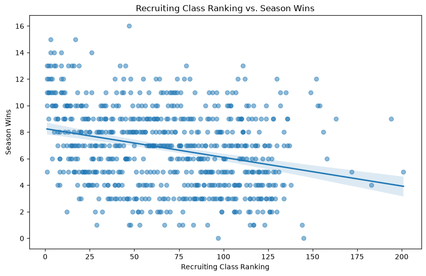
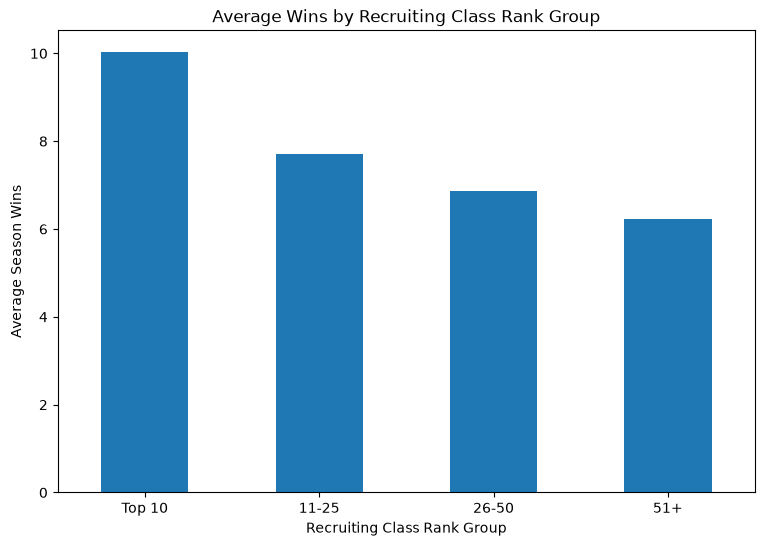

# College Football Recruiting and Team Performance

## Research Question

**To what extent do higher-ranked recruiting classes predict more wins in college football?**

The goal of this project is to examine whether college football teams with stronger recruiting classes tend to win more games. Recruiting rankings are widely used to evaluate the future potential of college football programs, but strong recruiting does not always guarantee success on the field.

---

## Why This Question Matters

Recruiting is one of the most important parts of building a college football roster. Coaches, athletic departments, analysts, and fans often use recruiting rankings to judge the strength and future potential of a program.

Understanding how closely recruiting success is actually related to winning can help show whether recruiting rankings are a strong indicator of future performance or only one piece of a much larger picture.

---

## Data Source

The data for this project was collected using the **CollegeFootballData API**.

I collected FBS team season records and recruiting rankings from the **2021 through 2025 seasons**.

The final dataset contains **663 team-season observations**.

Each row represents one FBS team during one season.

---

## Variables

### Recruiting Rank

**Conceptual variable:** The strength of a college football team's recruiting class.

**Operational variable:** The team's recruiting class ranking from CollegeFootballData.

A lower numerical ranking represents a stronger recruiting class.

### Season Wins

**Conceptual variable:** A team's on-field performance during a season.

**Operational variable:** The total number of wins earned by the team during that season.

---

## Data Cleaning and Preparation

The season record data and recruiting data were collected separately and merged using team name and season.

I checked for missing recruiting matches and found one unmatched record for Florida International in 2022.

Because the final analysis used an inner merge, only teams with both season performance and recruiting data were retained.

The final dataset contained **663 observations and no missing values** in the variables used for analysis.

---

## Exploratory Analysis

The average team in the dataset won approximately **6.8 games per season**, while the average recruiting rank was approximately **67.8**.

The correlation between recruiting rank and wins was approximately:

**-0.286**

Because lower recruiting rankings represent stronger recruiting classes, this negative correlation suggests that teams with stronger recruiting classes generally tend to win more games.

However, the relationship is not especially strong.

---

## Visualization 1: Recruiting Rank vs. Wins

This scatterplot compares recruiting class ranking with total season wins.

The downward trend suggests that stronger recruiting classes are generally associated with more wins. However, the large amount of variation shows that recruiting rank alone does not fully explain team success.

---

## Visualization 2: Average Wins by Recruiting Group

Teams were divided into recruiting groups based on their class ranking.

The average wins by group were approximately:

- **Top 10:** 10.02 wins
- **11–25:** 7.71 wins
- **26–50:** 6.86 wins
- **51+:** 6.23 wins

Teams with stronger recruiting classes generally averaged more wins.

---

## What I Found

The results suggest that stronger recruiting classes are associated with better team performance.

Teams with Top 10 recruiting classes averaged considerably more wins than teams ranked outside the Top 50.

However, recruiting alone does not determine whether a team will succeed.

Other factors such as coaching, player development, injuries, strength of schedule, returning players, conference difficulty, and the transfer portal may also have major effects on team performance.

Because this project measures an association, the results do not prove that stronger recruiting directly causes teams to win more games.

---

## Limitations, Ethics, and Reflection

This analysis only uses recruiting rankings and season wins, so it does not capture many other factors that influence college football success.

For example, the dataset does not account for coaching changes, injuries, strength of schedule, transfer portal additions, returning production, or differences in conference strength.

Recruiting rankings are also estimates of player and class quality rather than perfect measurements.

If I continued this project, I would include additional variables such as transfer portal rankings, strength of schedule, previous-season performance, and returning production.

This would allow for a more complete analysis of what factors contribute to winning in college football.

---

## Academic Research

Previous research has also examined the relationship between recruiting quality and college football performance.

These studies generally suggest that stronger recruiting can contribute to team success, while also showing that recruiting is not the only factor that determines performance.

---

## References

Caro, C. A. (2012). *College football success: The relationship between recruiting and winning*. International Journal of Sports Science & Coaching, 7(1), 139–152. https://doi.org/10.1260/1747-9541.7.1.139

Langelett, G. (2003). *The relationship between recruiting and team performance in Division 1A college football*. Journal of Sports Economics, 4(3), 240–245. https://doi.org/10.1177/1527002503253478

Bergman, S. A., & Logan, T. D. (2016). *The effect of recruit quality on college football team performance*. Journal of Sports Economics, 17(6), 578–600. https://doi.org/10.1177/1527002514538266

---

## Code

The full Python notebook used for this analysis is available here:

[View the Jupyter Notebook](https://github.com/Natemellenberger/college-football-recruiting-analysis/blob/main/recruiting_analysis.ipynb)

[View the GitHub Repository](https://github.com/Natemellenberger/college-football-recruiting-analysis)

---

## AI Transparency

I used ChatGPT to help explain Python concepts, troubleshoot code, organize parts of the notebook, improve written explanations, and assist with interpreting results.

I reviewed the suggestions, ran the code myself, and checked the final results before including them in the project.
