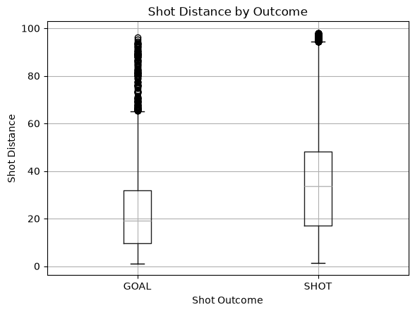
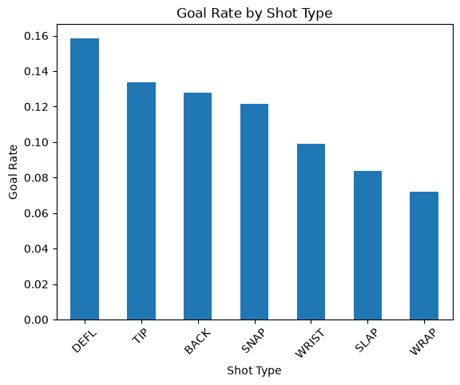
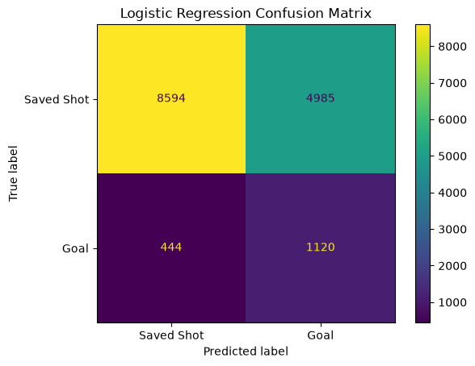
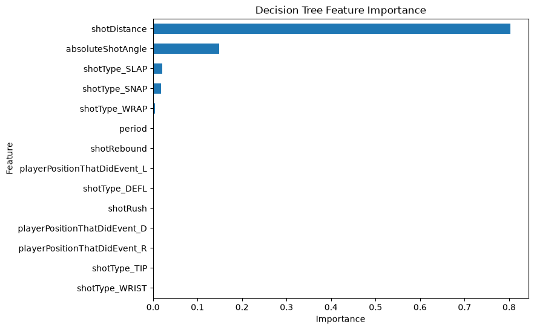

# NHL Shot Outcome Prediction

## Research Question

**Can the characteristics of an NHL shot predict whether the shot will result in a goal or be saved?**

The goal of this project is to examine whether shot characteristics such as distance, angle, shot type, player position, rebounds, and rush situations can help predict whether an NHL shot becomes a goal or is saved.

---

## Why This Question Matters

Shot quality is an important concept in hockey analytics because not every shot has the same chance of becoming a goal.

Coaches, analysts, scouts, and teams can use shot-level information to better understand which scoring opportunities are more dangerous and which factors are most strongly associated with scoring.

---

## Data Source

The data for this project comes from **MoneyPuck's 2025–2026 NHL shot dataset**.

The original dataset contains **119,271 shot events and 124 variables**.

Each row represents one NHL shot event.

For this analysis, I filtered the data to include only shots that resulted in either a goal or a save.

---

## Variables

The main variables used in the final model are:

- `shotDistance`: distance from the shot location to the goal.
- `absoluteShotAngle`: absolute angle of the shot relative to the center of the goal.
- `shotType`: type of shot taken.
- `period`: period in which the shot occurred.
- `playerPositionThatDidEvent`: position of the shooter.
- `shotRebound`: whether the shot was a rebound opportunity.
- `shotRush`: whether the shot occurred during a rush.
- `goal`: target variable where 1 represents a goal and 0 represents a saved shot.

---

## Data Cleaning and Preparation

Missed shots were removed because the research question specifically compares goals with saved shots.

Empty-net shots were also removed because there is usually no goalie present to make a save.

Rows with missing values in shot type or player position were removed because the number of missing observations was small compared with the full dataset.

Categorical variables such as shot type and player position were converted into numeric indicator variables using one-hot encoding.

The final modeling dataset contained **75,713 observations**.

---

## Exploratory Analysis

The target variable was highly imbalanced.

Approximately:

- **89.7%** of observations were saved shots.
- **10.3%** were goals.

The exploratory analysis showed several meaningful patterns.

Goals generally occurred from shorter distances and more central shooting angles.

Rebound and rush shots also had noticeably higher goal rates than non-rebound and non-rush shots.

---

## Visualization 1: Shot Distance by Outcome

Shots that became goals generally came from closer to the net than shots that were saved.

This suggests that shot distance is an important predictor of goal probability.

---

## Visualization 2: Goal Rate by Shot Type

Goal rates varied across different shot types.

Deflections and tip shots had some of the highest goal rates, while slap shots and wraparound attempts had lower goal rates.

---

## Baseline Model

Because saved shots make up most of the dataset, the baseline model predicted every shot as a save.

This produced approximately **89.7% accuracy**.

However, this baseline was not useful for identifying goals because it never predicted the minority class.

---

## Model Development

I trained two machine-learning models:

- **Logistic Regression**
- **Decision Tree Classifier**

The Logistic Regression model was appropriate because the target variable has two possible outcomes.

The Decision Tree was used because it can model nonlinear relationships between features such as shot distance, shot angle, and shot type.

To reduce overfitting and keep the Decision Tree interpretable, I limited it to a maximum depth of 5.

---

## Model Evaluation

Because the dataset was imbalanced, accuracy alone was not enough to evaluate the models.

I also used:

- **Precision**
- **Recall**
- **F1-score**

The balanced Logistic Regression achieved:

- **Accuracy:** 64.1%
- **Goal Precision:** 18.3%
- **Goal Recall:** 71.6%
- **Goal F1-score:** 0.292

The Decision Tree achieved:

- **Accuracy:** 55.2%
- **Goal Precision:** 16.3%
- **Goal Recall:** 81.1%
- **Goal F1-score:** 0.272

### Logistic Regression Confusion Matrix

The confusion matrix shows that the balanced Logistic Regression correctly identified many actual goals while also producing a substantial number of false positive goal predictions. This reflects the tradeoff involved in improving goal recall on an imbalanced dataset.

---

## What I Found

The balanced Logistic Regression performed better overall than the Decision Tree.

The Decision Tree identified a larger percentage of actual goals, but it also produced more false positive goal predictions.

The Logistic Regression provided a better balance between precision, recall, and F1-score.

Shot distance and shot angle were among the most influential features in both models.

---

## Model Interpretation

The Decision Tree relied most heavily on shot distance, followed by shot angle.

### Decision Tree Feature Importance

The feature-importance results show that shot distance was by far the most influential variable in the Decision Tree, followed by absolute shot angle. Shot type and other contextual features contributed much less to the model's decisions.

The Logistic Regression also showed that shots taken farther from the net and from wider angles were less likely to be predicted as goals.

This suggests that shot location is one of the strongest factors associated with whether an NHL shot becomes a goal.

---

## Limitations, Ethics, and Reflection

The dataset is highly imbalanced because goals occur much less frequently than saved shots.

The model also does not directly account for factors such as goalie skill, defensive pressure, screens, exact goalie positioning, or detailed player ability.

Different players and teams may also be represented unevenly in the dataset, which could affect how well the model works in different situations.

Incorrect predictions could lead analysts, coaches, or scouts to overestimate or underestimate the quality of certain scoring opportunities.

Because of these limitations, the model should be used as one analytical tool rather than as the sole basis for evaluating players or making coaching decisions.

If I continued this project, I would add features such as goalie performance, passing sequences, defensive pressure, player shooting ability, and strength situations.

---

## Academic Research

Previous hockey analytics research has examined how shot characteristics affect the probability of scoring.

Expected-goals models commonly use variables such as shot distance, shot angle, shot type, location, game state, and events occurring before the shot.

These ideas helped guide the feature selection and modeling decisions in this project.

---

## References

Kierans, J. (2021). *Isolation of latent player shooting ability in the National Hockey League* [Master's thesis, Concordia University].  
https://spectrum.library.concordia.ca/id/eprint/988845/

MoneyPuck. (n.d.). *About and how it works: Expected goals model*. MoneyPuck.  
https://www.moneypuck.com/about.htm

MoneyPuck. (n.d.). *Download data*. MoneyPuck.  
https://moneypuck.com/data.htm

Yurko, R. (2023). *National Hockey League shots*. SCORE Sports Data Repository.

---

## Code

The full Python notebook used for this analysis is available here:

[View the Jupyter Notebook](https://github.com/Natemellenberger/nhl-shot-outcome-prediction/blob/main/nhl_shot_prediction.ipynb)

[View the GitHub Repository](https://github.com/Natemellenberger/nhl-shot-outcome-prediction)

---

## AI Transparency

I used ChatGPT to help explain machine-learning concepts, troubleshoot code, organize parts of the notebook, improve written explanations, and assist with interpreting results.

I reviewed the suggestions, ran the code myself, and checked the final results before including them in the project.